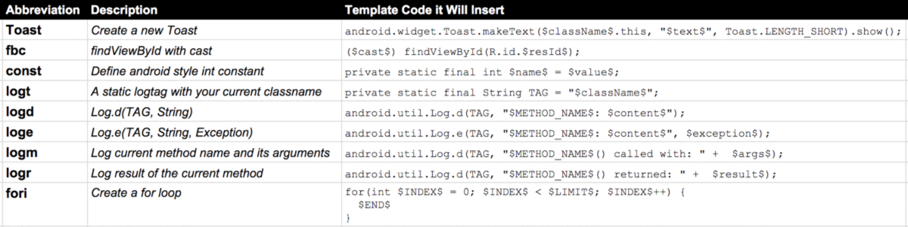

# 九月份阅读笔记
## 杂项
一、阅读列表
1. [Android 动态布局入门及 NinePatchChunk 解密－－【腾讯 Bugly 干货分享】](http://gold.xitu.io/entry/57c932bd7db2a20078853571)

2. [android-tips-tricks](https://github.com/nisrulz/android-tips-tricks/blob/master/Readme.md)
3. [AndroidTips0:Android:动态生成ID？](http://lfkdsk.github.io/2016/07/14/generate-view-id/)

4. [AndroidTips1:从View源码学习点击事件的模拟](http://gold.xitu.io/entry/57d10369128fe100550bbeb0)＿<未细读>
	了解了View的点击和长按判断的方式，其实从这个知识点可以发散的去想，这种发送延时Runnable的方式还可以放在很多的条件下使用

5. [Android中的指纹识别](https://gold.xitu.io/entry/57ce82f48ac247005fbdec8a)＿未读

6. [浅谈 Recycle 机制](http://gold.xitu.io/entry/57d111610e3dd90069be1c9b)＿<未细读>
	Message,TypedArray,Parcel都是也了回收机制, v4包还提供了Pool工具类, 另外也可以看看Pool目录下面其他的工具类.

7. [Android Development Useful Tools](https://medium.freecodecamp.com/android-development-useful-tools-fd73283e82e3#.xz77ts1yr)_未读

8. [What 2 Years of Android Development Have Taught Me the Hard Way](https://blog.aritraroy.in/what-my-2-years-of-android-development-have-taught-me-the-hard-way-52b495ba5c51#.kjvq53cli)_<未细度>
9. [App优化之ANR详解](http://www.jianshu.com/p/6d855e984b99)
	a. ANR的原因和解决方式

    b. trace.txt文件的位置/data/anr/
    `$adb pull data/anr/traces.txt .`

	c. 使用Thread和HandlerThread时, 为了使效果更好, 建议设置Thread的优先级偏低一点:
	`Process.setThreadPriority(THREAD_PRIORITY_BACKGROUND);`
    因为如果没有做任何优先级设置的话, 你创建的Thread默认和UI Thread是具有同样的优先级的, 你懂的. 同样的优先级的Thread, CPU调度上还是可能会阻塞掉你的UI Thread, 导致ANR的.

10. [Android WebView: 性能优化不得不说的事](https://gold.xitu.io/entry/57d6434067f3560057e50b20)_未读

11. [Android Scroll详解(一)：基础知识](http://mp.weixin.qq.com/s?__biz=MzA3MDMyMjkzNg==&mid=2652261964&idx=1&sn=b778b329bcea467e11ccbe879e0236da&scene=1&srcid=0918c6RNu88dRm9ztl46dGBu#wechat_redirect)

http://mp.weixin.qq.com/s?__biz=MzA3MDMyMjkzNg==&mid=2652261966&idx=1&sn=3b05f70c118a24e33b5a0e69b59af0b9&scene=0#wechat_redirect

http://mp.weixin.qq.com/s?__biz=MzA3MDMyMjkzNg==&mid=2652261966&idx=2&sn=6889dc9c2895fec48876314d7707cdb0&scene=0#wechat_redirect

12. [Android Handler Internals](https://medium.com/@jagsaund/android-handler-internals-b5d49eba6977#.6b218fuy0)
最全面的Handler讲解，内存泄漏（更彻底），Message Pool，Looper和MessageQueue
13. 


## 模块
一、内存泄漏模块

[Android 内存泄露总结](http://duanmo.me/2016/04/17/memory-leak-summary/#%E9%9D%9E%E9%9D%99%E6%80%81%E5%86%85%E9%83%A8%E7%B1%BB%E9%80%A0%E6%88%90%E7%9A%84%E5%86%85%E5%AD%98%E6%B3%84%E9%9C%B2)

[使用新版Android Studio检测内存泄露和性能](http://www.jianshu.com/p/216b03c22bb8/comments/1137567)


二、Gradle模块

[New Build System](http://tools.android.com/tech-docs/new-build-system)
来自Google，应该可以解决所有Gradle相关的问题
    
其他: Gradle全局设置:
[参考一　感觉这个靠谱](http://crushingcode.co/update-dependencies-code-repeat/?utm_source=Android+Weekly&utm_campaign=1096591845-Android_Weekly_221&utm_medium=email&utm_term=0_4eb677ad19-1096591845-337846681)
[参考二](http://wuxiaolong.me/categories/Gradle/)
[参考三](https://segunfamisa.com/posts/android-gradle-extra-properties?utm_source=Android+Weekly&utm_campaign=5ba9a634ac-Android_Weekly_220&utm_medium=email&utm_term=0_4eb677ad19-5ba9a634ac-33784668)

[Gradle完整指南(Android)](http://www.jianshu.com/p/9df3c3b6067a)


未读
[How I save 5h/week on Gradle builds](https://medium.com/@cesarmcferreira/speeding-up-gradle-builds-619c442113cb#.lzn3dvts0)
[Making Gradle builds faster](http://zeroturnaround.com/rebellabs/making-gradle-builds-faster/)


三、AAR
Android Studio中的module相当于library，与jar包的区别是aar可以包含资源和class，而jar只能包含class

1. [R.java中的字段不再是final](http://tools.android.com/tips/non-constant-fields)
所以switch...case中不能使用R.id了，应该使用if...else

2. [ApplicationId versus PackageName](http://tools.android.com/tech-docs/new-build-system/applicationid-vs-packagename)
aar中的R.java属于它自己的Manifest中指定的packageName，通过反射使用aar或者把aar作为library使用，不在需要顾虑R中资源访问的问题

**使用aar:**
1. 在app的build.gradle中加入以下配置
```
	repositories{
		flatDir{
        	dir 'libs' // aar目录
      	}
    }
```
2. 将aar文件拷贝到app/libs目录下
3. 在dependencies中引用
`compile(name: 'zbar-resease', ext: ''aar)`

四、ADB常用命令
adb shell dumpsys activity

五、设计模式
1. [策略模式](http://gold.xitu.io/entry/57d3780c2e958a00545c090b)
公司要求说出在工作中用到的设计模式, 单例模式除外, 简单点的答案就是这个了.

Six [Writing More Code by Writing Less Code with Android Studio Live Templates](https://medium.com/google-developers/writing-more-code-by-writing-less-code-with-android-studio-live-templates-244f648d17c7?swoff=true#.geeg3saiz)_need vpn
Teach you how to config live template: pay attention to expression and applicable context

A small sampling of Android Studio Live Templates



[Android Studio Skill](http://www.open-open.com/lib/view/open1473732827819.html)

[Gradle](http://www.open-open.com/lib/view/open1472821825252.html)

[Android 7.0 Notification](http://www.open-open.com/lib/view/open1473299917718.html)


MultiDex
http://tech.meituan.com/mt-android-auto-split-dex.html
http://www.open-open.com/lib/view/open1452264136714.html

asfd
