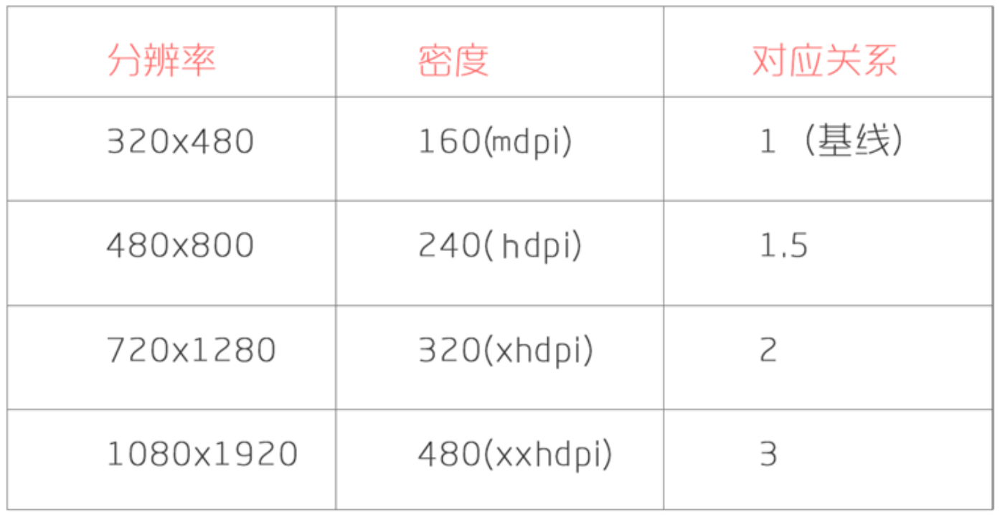

#####十一月份阅读笔记
* * *


1. [Android 跨 module 交互和方法调用](http://gold.xitu.io/entry/5811c1b9a22b9d00639f5d8c)
	A依赖B和C, B和C依赖D, B和C没有依赖关系, 可以通过D间接关联
2. sw计算问题
例如：value-sw360-xxhdpi-1920x1080
首先介绍sw360的算法:
sw = 160 * 1080 / 480 = 360,
由下面的图标关系可知，=
1080对应xxhdpi,那么就对应value-sw360-xxhdpi-1920x1080，那么为什么还要写xxhdpi,如果我在来取一个手机的参数，1280x720，分比率为320，那么sw = 160 * 720 / 320 = 360,同样还是360，因此为了更详细后面还要添加xhdpi才能够确定手机分辨率。

3. [浅谈ANR及log分析ANR](http://blog.csdn.net/chenshijun0101/article/details/7476174)

4. [Android中子线程真的不能更新UI吗？](http://blog.csdn.net/xyh269/article/details/52728861)

5. [Android Binder跨进程通信原理分析](http://blog.csdn.net/xyh269/article/details/53355399)


6.　Gradle动态修改app_name

```
def currentTime() {
    return new Date().format("yyyy_MM_dd HH:mm:ss", TimeZone.getTimeZone("GMT+8"))
}

def app_name_release = "Emoticon"
def debug_suffix = "debug"

android{
  ...
  buildTypes {
        release {
            ...
            resValue("string", "app_name", app_name_release)
        }
        debug {
            resValue("string", "app_name", "${app_name_release}_${debug_suffix}_${currentTime()}")
        }
      }
  ...
}
```

7.[Android 实践之 ScrollView 中滑动冲突处理](http://gold.xitu.io/entry/58384f460ce463006b939fbc)－－未读

8.[Android 爬坑之旅：软键盘挡住输入框问题的终极解决方案](http://www.diycode.cc/topics/383)

