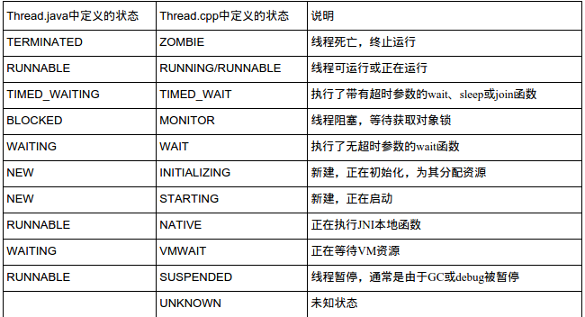

## 一、查看Log ##
日志过滤`ActivityManager`关键字，查看发生ANR的进程名称、PID、Reason、Load和CPU的使用率

	E/ActivityManager: ANR in com.example.administrator.myapplication (com.example.administrator.myapplication/.MainActivity)
              PID: 25199
              Reason: Input dispatching timed out (Waiting because no window has focus but there is a focused application that may eventually add a window when it finishes starting up.)
              Load: 7.54 / 7.57 / 7.47
              CPU usage from 598163ms to 0ms ago (2018-04-22 12:41:15.057 to 2018-04-22 12:51:13.220):
                99% 25199/com.example.administrator.myapplication: 99% user + 0.3% kernel / faults: 56 minor
                20% 1686/system_server: 12% user + 7.4% kernel / faults: 17550 minor 1 major

 

过滤关键字：dalvikvm或者art

	I/art: Thread[3,tid=7631,WaitingInMainSignalCatcherLoop,Thread*=0x7f7d435000,peer=0x12d98790,"Signal Catcher"]: reacting to signal 3
	I/art: Wrote stack traces to '/data/anr/traces.txt'

进程处理SIGNAL_QUIT signal, 并把anr信息写入traces.txt文件.
进程的虚拟机实例接收到SIGNAL_QUIT信号后会由"Signal Catcher"线程将进程中各个线程的函数堆栈信息输出到traces.txt文件中.

 
## 二、查看traces.txt文件 ##

traces.txt文件中每个线程都有状态，对应如下

 
> traces.txt只保留最后一次发生ANR时的信息。
> 
> android 2.2开始增加了DropBox功能, 保留历史上发生的所有ANR的log，“/data/system/dropbox”是DB指定的文件存放位置。
> 
> 日志保存的最长时间， 默认是3天。

    root@android:/data/system/dropbox # ls
	SYSTEM_BOOT@1464834107910.txt
	SYSTEM_TOMBSTONE@1464595870188.txt.gz
	SYSTEM_TOMBSTONE@1464835783944.txt.gz
	data_app_anr@1464666793921.txt.gz
	data_app_anr@1464838359233.txt.gz
	data_app_anr@1464838782715.txt.gz
	data_app_anr@1464839493673.txt.gz
	data_app_anr@1464840013776.txt.gz
	system_app_anr@1464838619773.txt.gz
	system_app_anr@1464838693689.txt.gz
	system_app_anr@1464838742647.txt.gz
	root@android:/data/system/dropbox #

**SystemServer在启动时， 会创建并添加DROPBOX_SERVICE**

	//SystemServer.java
	private void startOtherServices() {
	... ...
	            try {
	                Slog.i(TAG, "DropBox Service");
	                ServiceManager.addService(Context.DROPBOX_SERVICE,
	                        new DropBoxManagerService(context, new File("/data/system/dropbox")));
	            } catch (Throwable e) {
	                reportWtf("starting DropBoxManagerService", e);
	            }
	... ...
	}

**ActivityManagerService.java中的appNotResponding()方法负责把日志写入traces.txt文件中**
