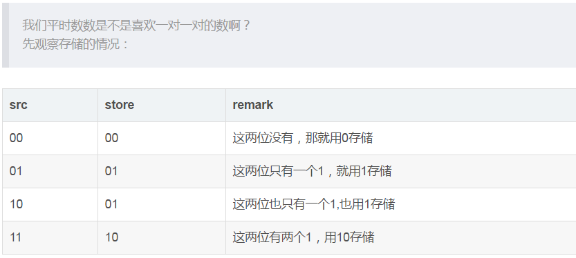
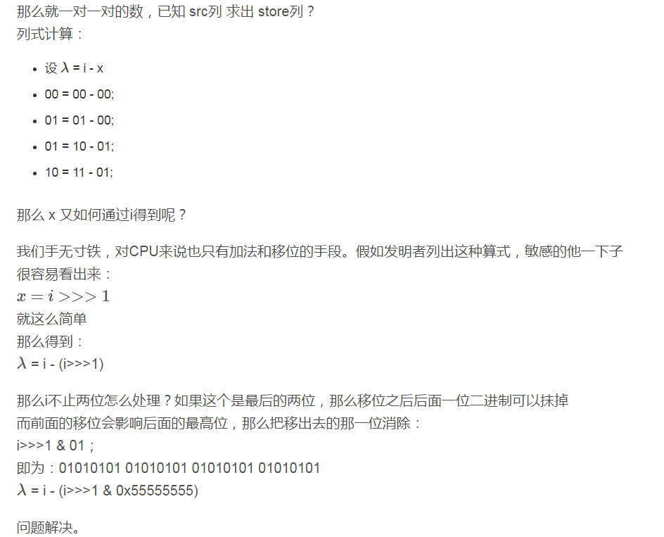

### 一、统计整数补码的二进制表示中1的个数 ###

**先看下几个概念**

-  正整数的原码、反码、补码完全一样

- 负整数的符号位固定为1，由原码变为补码时，规则如下：
	>1.原码符号位1不变，整数的每一位二进制数位求反，得到反码
	>
	>2.反码符号位1不变，反码数值位最低位加1，得到补码

 

算法代码：

    public static int bitCount(int i) {
        // HD, Figure 5-2
        i = i - ((i >>> 1) & 0x55555555);
        i = (i & 0x33333333) + ((i >>> 2) & 0x33333333);
        i = (i + (i >>> 4)) & 0x0f0f0f0f;
        i = i + (i >>> 8);
        i = i + (i >>> 16);
        return i & 0x3f;
    }

解析：

---
 

通过上面的步骤，得到两个bit位一组的二进制值，每组二进制的值表示对应的两个bit位上1的个数。

现在把整数的二进制按四个bit位分组:aabb
> 低两位 bb == aabb & 0011
>
> 高两位 aa == aabb >>> 2

 

要计算aa++bb,即

λ =( i & 0x0011) + (i>>>2 & 0x0011) 

也就是:
 
λ =( i & 0x33333333) + (i>>>2 & 0x33333333)

---
 

同理，得到四个bit位一组的二进制值，每组二进制的值表示对应的四个bit位上1的个数。

现在把整数的二进制按八个bit位分组:aaaabbbb

λ =( i + i>>>4) & 0x0F0F0F0F； // 注意aaaa+bbbb不会向高位进位

---
 

同理，得到八个bit位一组的二进制值，每组二进制的值表示对应的八个bit位上1的个数。

现在把整数的二进制按十六个bit位分组:aaaaaaaabbbbbbbb

λ = i + (i >>> 8); 

由于二等分是8位，而8位一共有4份。
 
A B C D

(C>>>8) + D D处8位的结果最大为 0001 0000不会进位到C。 

(B>>>8) + C C处8位的结果最大为 0001 0000不会进位到B。
 
(A>>>8) + B B处8位的结果最大为 0001 0000不会进位到A。
 
A + 0 A处最大结果为 0000 1000

得到 

A A+B B+C C+D 

---
 

最后是求2位全部的内容也就是求(A+B)+(C+D) 

A A+B B+C C+D 

+

0 0 A A+B

也就是 

λ= i + (i >>> 16) 

A A+B A+B+C A+B+C+D 

A+B+C+D最大也就32个： 

0000 0000 0000 0000 0000 0000 0010 0000 

0000 0000 0000 0000 0000 0000 0011 1111 = 0x3F 

之所以要return i&0x3F，就是把前面抹干净。