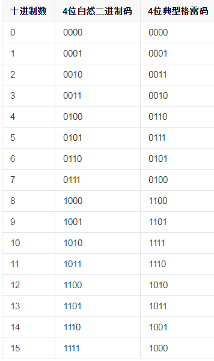
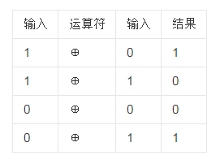

## 一、找出数组中出现次数超过一半的数 ##

这个算法的时间复杂度是O(n)，另外用了两个辅助变量。

通过打擂台的形式，最后保存的变量为**出现次数超过一半的数**

    private int getValue() {
        int[] array = {1, 3, 3, 3, 3, 2, 4};
        int count = 0;
        int result = array[0];
        for (int i = 0; i < array.length; ++i) {
            if (count == 0 || result == array[i]) {
                result = array[i];
                ++count;
            } else {
                --count;
            }
        }
        return result;
    }

 

## 二、把1~1000拼接成字符串，求7出现的个数（腾讯面试过） ##

添加把数字添加前缀0，让数字长度相等,问题就转换成000 ~ 999, 拼接成字符串，求7出现的次数

        000
        001
        ...
        010
        011
        ...
        100
        101
        ...
        998
        999

000~999拼接成字符串，总共1000 * 3 个数字，0~9中每个数字出现的次数是一样的。

那么7出现的次数为 （1000 * 3）/ 10 = 300 次

 

## 三、格雷码的生成  ##

可以根据规则生成格雷码，也可以根据规定递归生成

 

## 四、位运算符  ##

**异或的运算**

 
#### 交换两个整数的值 ####

        int a = 9;
        int b = 11;

        a=a^b; 1001^1011=0010
        b=b^a; 1011^0010=1001
        a=a^b;  0010^1001=1011

        //结果
        a = 11;
        b = 9;

 
#### 正整数的二进制表示中1的个数 ####

>把一个整数减去1之后再和原来的整数做位与运算，得到的结果相当于是把整数的二进制表示中的最右边一个1变成0

    int count(int n) {
        int num = 0;
        while (n) {
            n &= (n - 1);
            num++;
        }
        return num;
    }

 
#### 两个整数m和n，计算需要改变m的二进制表示中的多少位才能得到n。 ####

> 结合上面的知识， 求这两个数的异或， 然后统计异或结果中1的位数

 
#### 用一条语句判断一个整数是不是2的整数次方 ####

一个整数如果是2的整数次方，那么它的二进制表示中有且只有一位是1，而其它所有位都是0 。 根据前面的分析，把这个整数减去1后再和它自己做与运算，这个整数中唯一的1就变成0了。
>!（x & (x - 1)）

 
#### 一个整型数组里除了两个数字之外，其他的数字都出现了两次。请写程序找出这两个只出现一次的数字 ####

两个相同的整数异或结果为0， 数组中所有数异或之后，结果是出现一次的两个整数a和b的异或结果。

然后把数组分成两部分：和a的二进制中最低位为1的位置相同的数当成一组新数组。

问题就转换成**一个整型数组里除了一个数字之外，其他的数字都出现了两次。请写程序找出这个只出现一次的数字**