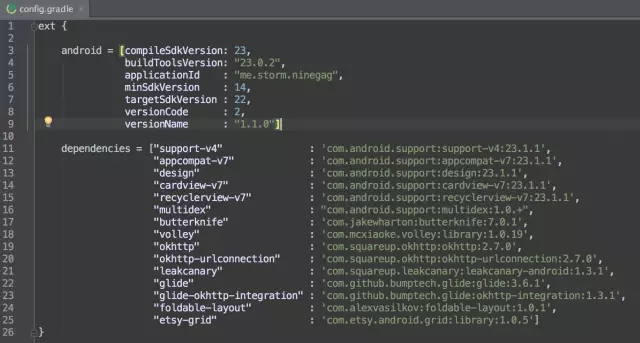
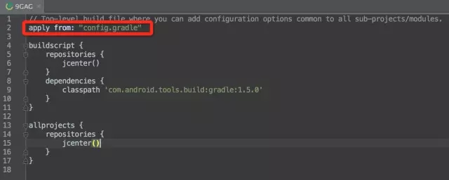
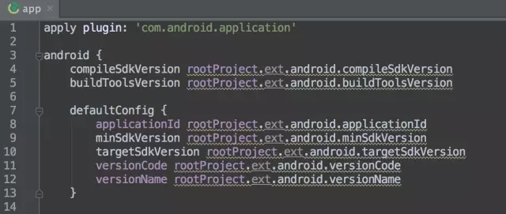
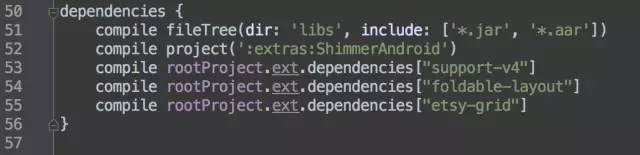
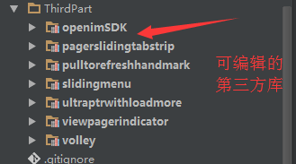
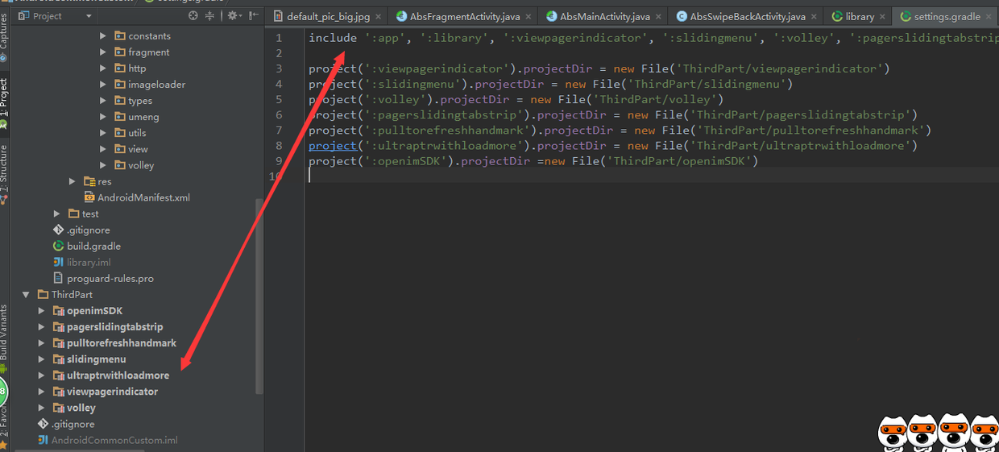

# Gradle在Android Studio中的使用 #

## 一、统一依赖管理 ##
如果工程的module想依赖个support-v4包，直接一句话：
    compile 'com.android.support:support-v4:23.1.1'

但是工程中多个module都依赖support-v4包，那么需要重复添加多次，如果v4包的依赖版本发生改变，修改起来就很麻烦。

可以把`23.1.1.`或者`com.android.support:support-v4:23.1.1`提取出来，在某个文件中统一管理

在工程根目录下的build.gradle中，添加`app from: "config.gradle"`，使所有的子项目或者所有的modules都可以从这个配置文件里读取内容。

在module下的build.gradle文件里同下面的方式读取即可

参考[Gradle依赖的统一管理](http://mp.weixin.qq.com/s?__biz=MzA4NTQwNDcyMA==&mid=402733201&idx=1&sn=052e12818fe937e28ef08331535a179e&scene=21#wechat_redirect)

另外，[How to add Gradle dependencies using ‘foreach’](https://hackernoon.com/android-how-to-add-gradle-dependencies-using-foreach-c4cbcc070458#.yz9jc8yc1)也值得学习和参考，需要翻墙才能访问

## 三、aar函数库的引用 ##

假设工程有三个module：app, thirdparty和pay

在thirdparty的libs目录下存放*.jar，*.so和*.aar，app依赖thirdpaty,为了能正常依赖thirdpaty中的*.aar，需要在thirdparty/build.gradle文件中添加如下配置

	repository{
		flatDir{
			dirs 'libs'
		}
	}

如果pay也依赖thirdparty，为了让pay能正常使用thirdparty中提供的api，以及引用其中的aar文件，需要在pay/build.gradle添加如下配置：

	repository{
		flatDir{
			dirs '../thirdparty/libs'
		}
	}

## 三、剔除module下jar文中不需要打包的文件 ##

	android {
	    compileSdkVersion rootProject.ext.compileSdkVersion
	    buildToolsVersion rootProject.ext.buildToolsVersion
	
	    defaultConfig {
	        applicationId rootProject.ext.applicationId
	        minSdkVersion rootProject.ext.minSdkVersion
	        targetSdkVersion rootProject.ext.targetSdkVersion
	        versionCode rootProject.ext.versionCode
	        versionName rootProject.ext.versionName
	        multiDexEnabled true
	    }
	
		// jar包中下面的文件不打包
	    packagingOptions {
	        exclude 'LICENSE.txt'
	        exclude 'META-INF/DEPENDENCIES'
	        exclude 'META-INF/ASL2.0'
	        exclude 'META-INF/NOTICE'
	        exclude 'META-INF/LICENSE'
	    
	    ...
	}

当module下的多个jar包含相同文件，编译会报错`Android Studio: Duplicate files copied in APK META-INF/DEPENDENCIES when compile`，使用packagingOptions可以避免打包重复的文件。

参考[stackoverflow](http://stackoverflow.com/questions/27977396/android-studio-duplicate-files-copied-in-apk-meta-inf-dependencies-when-compile)

## 四、动态修改app_name ##
	def currentTime() {
	    return new Date().format("yyyy_MM_dd HH:mm:ss", TimeZone.getTimeZone("GMT+8"))
	}
	
	def app_name_release = "Emoticon"
	def debug_suffix = "debug"
	
	android{
	  ...
	  buildTypes {
	        release {
	            ...
	            resValue("string", "app_name", app_name_release)
	        }
	        debug {
	            resValue("string", "app_name", "${app_name_release}_${debug_suffix}_${currentTime()}")
	        }
	      }
	  ...
	}

## 五、把多个三方可编辑的的module放在同一个文件夹中管理 ##

只需要在工程的setting.gradle中进行如下配置

## 六、 Lint ##
在Android Studio的终端,输入`./gradlew lint`,会在每个Module的`/build/outputs/`下生成检测报告