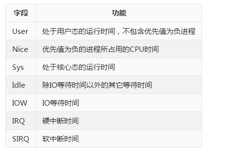

## 一、 adb shell top命令 ##

    adb shell top -h #查看帮助文档

该命令默认显示进程信息，添加参数-t可以显示线程信息

进程的属性如下表所示:

关于内存耗用：

	VSS - Virtual Set Size 虚拟耗用内存（包含共享库占用的内存）
	RSS - Resident Set Size 实际使用物理内存（包含共享库占用的内存）
	PSS - Proportional Set Size 实际使用的物理内存（比例分配共享库占用的内存）
	USS - Unique Set Size 进程独自占用的物理内存（不包含共享库占用的内存）

## 二、 dumpsys命令 ##
- 查看手机崩溃的日志
`adb shell dumpsys dropbox system_app_crash --print`

另外dumpsys还有其他常用的参数,详细可查看帮助，例如`adb shell dumpsystem meminfo -h`

1. activity: 显示运行activity信息
1. cpuinfo: 显示CPU信息
1. meminfo:　显示内存信息
1. package: 显示package信息
1. battery/batteryinfo: 显示电池/使用信息
1. alarm:　显示alarm信息

## 三、 AAPT ##
AAPT是Android Asset Packagint Tool
按照上面环境变量的配置,把aapt添加到环境变量,可以使用`./aapt`查看帮助
常用`aapt`查看apk的版本信息和权限

1. 查看版本
`./aapt d[ump] badging apk-path`
1. 查看权限
`./aapt d[ump] permissions apk-path`
1. 查看使用帮助
`./aapt`

另外`aapt`源代码位于`/frameworks/base/tools/aapt/`目录下面,可以修改源码来实现某些功能

公司内部提供的获取所有应用的权限列表apk, 保存到`sdcard`上的xls文件中,该功能是否可以修改这个工具来实现?

## 四、 logcat ##
	adb logcat --help	#查看帮助文档

	Usage: logcat [options] [filterspecs]
	options include:
	  -s              Set default filter to silent. Like specifying filterspec '*:S'
	
	filterspecs are a series of
	  <tag>[:priority]
	
	where <tag> is a log component tag (or * for all) and priority is:
	  V    Verbose (default for <tag>)
	  D    Debug (default for '*')
	  I    Info
	  W    Warn
	  E    Error
	  F    Fatal
	  S    Silent (suppress all output)

需要注意的是

	adb logcat -s tag_name`等价与`adb logat *:S tag_name		#只输出TAG为tag_name的日志

	adb logat tag_name:S									#输出除TAG为tag_name以外的所有日志

## 五、 屏幕录像和截屏、查看手机分辨率和屏幕密度(适用于api 19以上)##
**截屏**

	adb shell screencap -p sdcard/demo.png

**录像**

	adb shell
	screenrecord sdcard/demo.mp4
	Ctrl+C 停止

**Android 4.3引入的wm工具**

1. 获取Android设备屏幕分辨率： `adb shell wm size`
1. 获取android设备屏幕密度： `adb shell wm density`

这两个功能是由代码提供的,类似`aapt`,可以修改相应代码来实现一些功能
[参考链接](http://www.cnblogs.com/fanfeng/p/3263853.html)

**获取手机型号和设备信息**

	adb shell
	cat /system/build.prop | grep "product" #获取设备信息,如device=GIONEE_SWG1613

## 六、 Jar重新打包 ##
把当前目录下的文件打包到name.jar
`jar cvf name.jar ./*`

另外，打包程jar后，里面会生成一个文件，修改该文件可以指定jar的运行规则
[具体可以参考该链接](http://jingyan.baidu.com/article/ff42efa904b4d7c19e220282.html)

## 七、 Ubuntu卡死解决方法 ##
	sudo kill -9  `ps -ef | grep tty7 | awk 'NR==1 {print $2}'`

或者

1. Ctrl+Alt+F1 进入 tty1
1. ps -t tty7 查看进程,找到Xorg进程的进程号例如1303
1. sudo kill 1303 杀死进程,接着会自动重启到登陆界面

## 八、 Ubuntu环境变量的配置 ##
**用户环境变量通常被存储在下面的文件中**

- ~/.bashrc
- ~/.profile
- ~/.bash_profile or ~/.bash_login

**系统环境变量通常被存储在下面的文件中**

- /etc/profile
- /etc/environment
- /etc/bash.bashrc

**加入环境变量**

我一般都是修改系统环境变量`/etc/profile`

	export PATH="$PATH:/my_new_path"
这样下次用户登陆就会生效,如果想立刻生效使,用下面的命令

	$source /etc/profile

